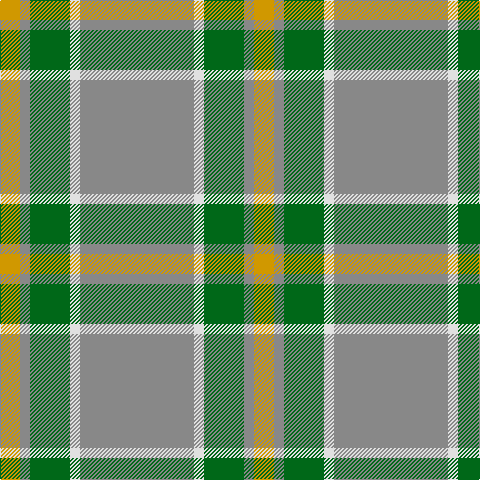

The parent of this is [Johore (District)](/tartans/dy/20/n10/g40/ln10/n/114/)

This was sourced from tartans-authority.  It is a [5 stripes tartan](/stripes/stripes5/).

Original link http://www.tartansauthority.com/tartan-ferret/display/1309/

## Thread count
DY/20 N10 G40 LN10 N/114

## Palette
Each colour and its ΔE from the base-6 reference it is a variant of.

| Colour | Shade | Base | ΔE (OKLab) |
|---|---|---|---|
| DY |  `#D09800` | Y  | 0.11 |
| G |  `#006818` | G  | 0.02 |
| LN |  `#E0E0E0` | W  | 0.06 |
| N |  `#888888` | R  | 0.24 |

# Sample pattern

ID: /variants/dy/20/n10/g40/ln10/n/114-dyd09800-g006818-lne0e0e0-n888888/
