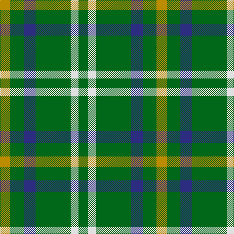

The parent of this is [Meath County Crest (Fashion)](/tartans/dy/21/g28/db24/g72/ln16/g/20/)

This was sourced from tartans-authority.  It is a [6 stripes tartan](/stripes/stripes6/).

Original link http://www.tartansauthority.com/tartan-ferret/display/7410/

## Thread count
DY/21 G28 DB24 G72 LN16 G/20

## Palette
Each colour and its ΔE from the base-6 reference it is a variant of.

| Colour | Shade | Base | ΔE (OKLab) |
|---|---|---|---|
| DB |  `#2C2C80` | B  | 0.05 |
| DY |  `#BC8C00` | Y  | 0.16 |
| G |  `#006818` | G  | 0.02 |
| LN |  `#E0E0E0` | W  | 0.06 |

# Sample pattern

ID: /variants/dy/21/g28/db24/g72/ln16/g/20-db2c2c80-dybc8c00-g006818-lne0e0e0/
