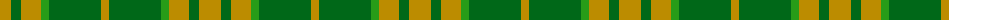

The parent of this is [North Dakota State University (Corp.](/tartans/dy/22/ga10/dy20/g8/ga52/dy/8/)

This was sourced from tartans-authority.  It is a [6 stripes tartan](/stripes/stripes6/).

Original link http://www.tartansauthority.com/tartan-ferret/display/10517/

## Thread count
DY/22 Ga10 DY20 G8 Ga52 DY/8

## Palette
Each colour and its ΔE from the base-6 reference it is a variant of.

| Colour | Shade | Base | ΔE (OKLab) |
|---|---|---|---|
| DY |  `#BC8C00` | Y  | 0.16 |
| G |  `#289C18` | G  | 0.18 |
| Ga |  `#006818` | G  | 0.02 |

# Sample pattern

ID: /variants/dy/22/ga10/dy20/g8/ga52/dy/8-dybc8c00-g289c18-ga006818/
