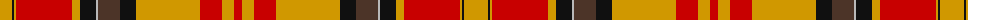

The parent of this is [Aboyne I (Fashion)](/tartans/dy/24/k2/dy2/r56/dy8/k16/n2/t22/k16/dy64/r22/dy12/r/8/)

This was sourced from tartans-authority.  It is a [13 stripes tartan](/stripes/stripes13/).

Original link http://www.tartansauthority.com/tartan-ferret/display/3014/

## Thread count
DY/24 K2 DY2 R56 DY8 K16 N2 T22 K16 DY64 R22 DY12 R/8

## Palette
Each colour and its ΔE from the base-6 reference it is a variant of.

| Colour | Shade | Base | ΔE (OKLab) |
|---|---|---|---|
| DY |  `#D09800` | Y  | 0.11 |
| K |  `#101010` | K  | 0.17 |
| N |  `#B8B8B8` | Y  | 0.17 |
| R |  `#C80000` | R  | 0.00 |
| T |  `#4C3428` | B  | 0.16 |

ID: /variants/dy/24/k2/dy2/r56/dy8/k16/n2/t22/k16/dy64/r22/dy12/r/8-dyd09800-k101010-nb8b8b8-rc80000-t4c3428/
