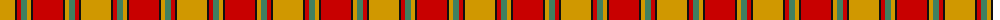
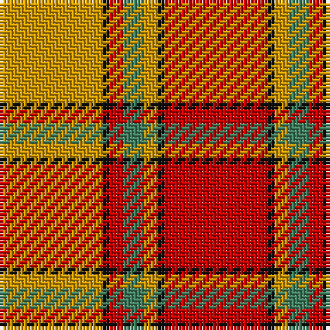

The parent of this is [Scrymgeour (Clan)](/tartans/dy/30/k2/r4/g6/dy4/k2/r/30/)

This was sourced from tartans-authority.  It is a [7 stripes tartan](/stripes/stripes7/).

Original link http://www.tartansauthority.com/tartan-ferret/display/1627/

## Thread count
DY/30 K2 R4 G6 DY4 K2 R/30

## Palette
Each colour and its ΔE from the base-6 reference it is a variant of.

| Colour | Shade | Base | ΔE (OKLab) |
|---|---|---|---|
| DY |  `#D09800` | Y  | 0.11 |
| G |  `#408060` | G  | 0.13 |
| K |  `#101010` | K  | 0.17 |
| R |  `#C80000` | R  | 0.00 |

# Sample pattern

ID: /variants/dy/30/k2/r4/g6/dy4/k2/r/30-dyd09800-g408060-k101010-rc80000/
