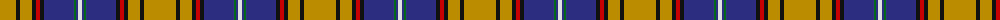

The parent of this is [Otago (District)](/tartans/dy/32/k4/dy12/k4/r4/k4/db30/g2/db2/ln/4/)

This was sourced from tartans-authority.  It is a [10 stripes tartan](/stripes/stripes10/).

Original link http://www.tartansauthority.com/tartan-ferret/display/2317/

## Thread count
DY/32 K4 DY12 K4 R4 K4 DB30 G2 DB2 LN/4

## Palette
Each colour and its ΔE from the base-6 reference it is a variant of.

| Colour | Shade | Base | ΔE (OKLab) |
|---|---|---|---|
| DB |  `#2C2C80` | B  | 0.05 |
| DY |  `#BC8C00` | Y  | 0.16 |
| G |  `#006818` | G  | 0.02 |
| K |  `#101010` | K  | 0.17 |
| LN |  `#E0E0E0` | W  | 0.06 |
| R |  `#C80000` | R  | 0.00 |

ID: /variants/dy/32/k4/dy12/k4/r4/k4/db30/g2/db2/ln/4-db2c2c80-dybc8c00-g006818-k101010-lne0e0e0-rc80000/
