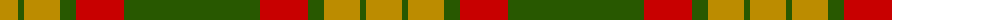
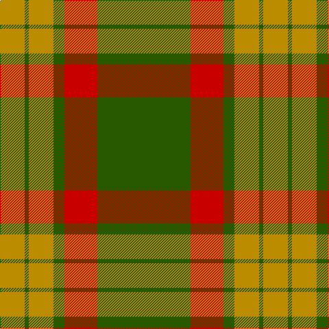

The parent of this is [MacMillan/Isetan (Corporate)](/tartans/dy/36/g6/dy36/g16/r48/g/136/)

This was sourced from tartans-authority.  It is a [6 stripes tartan](/stripes/stripes6/).

Original link http://www.tartansauthority.com/tartan-ferret/display/6310/

## Thread count
DY/36 G6 DY36 G16 R48 G/136

## Palette
Each colour and its ΔE from the base-6 reference it is a variant of.

| Colour | Shade | Base | ΔE (OKLab) |
|---|---|---|---|
| DY |  `#BC8C00` | Y  | 0.16 |
| G |  `#285800` | G  | 0.04 |
| R |  `#C80000` | R  | 0.00 |

# Sample pattern

ID: /variants/dy/36/g6/dy36/g16/r48/g/136-dybc8c00-g285800-rc80000/
