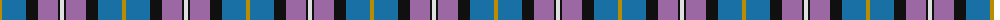

The parent of this is [Soroptimist International (Corporate](/tartans/dy/4/b24/k12/lp20/k2/ln/4/)

This was sourced from tartans-authority.  It is a [6 stripes tartan](/stripes/stripes6/).

Original link http://www.tartansauthority.com/tartan-ferret/display/3097/

## Thread count
DY/4 B24 K12 LP20 K2 LN/4

## Palette
Each colour and its ΔE from the base-6 reference it is a variant of.

| Colour | Shade | Base | ΔE (OKLab) |
|---|---|---|---|
| B |  `#1870A4` | B  | 0.14 |
| DY |  `#BC8C00` | Y  | 0.16 |
| K |  `#101010` | K  | 0.17 |
| LN |  `#E0E0E0` | W  | 0.06 |
| LP |  `#9C68A4` | R  | 0.21 |

# Sample pattern

ID: /variants/dy/4/b24/k12/lp20/k2/ln/4-b1870a4-dybc8c00-k101010-lne0e0e0-lp9c68a4/
