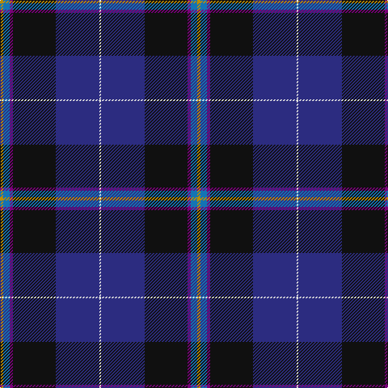

The parent of this is [Pipers' Trail (Corporate)](/tartans/dy/4/b8/p4/k53/db54/ln/2/)

This was sourced from tartans-authority.  It is a [6 stripes tartan](/stripes/stripes6/).

Original link http://www.tartansauthority.com/tartan-ferret/display/8014/

## Thread count
DY/4 B8 P4 K53 DB54 LN/2

## Palette
Each colour and its ΔE from the base-6 reference it is a variant of.

| Colour | Shade | Base | ΔE (OKLab) |
|---|---|---|---|
| B |  `#1474B4` | B  | 0.15 |
| DB |  `#2C2C80` | B  | 0.05 |
| DY |  `#BC8C00` | Y  | 0.16 |
| K |  `#101010` | K  | 0.17 |
| LN |  `#E0E0E0` | W  | 0.06 |
| P |  `#780078` | B  | 0.16 |

# Sample pattern

ID: /variants/dy/4/b8/p4/k53/db54/ln/2-b1474b4-db2c2c80-dybc8c00-k101010-lne0e0e0-p780078/
