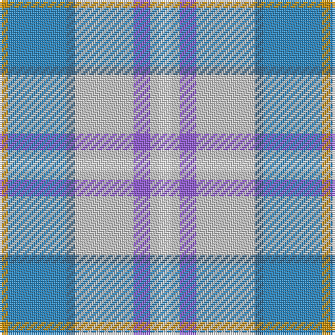

The parent of this is [Seaside (Fashion)](/tartans/dy/4/ba28/b4/n28/p8/n4/w/6/)

This was sourced from tartans-authority.  It is a [7 stripes tartan](/stripes/stripes7/).

Original link http://www.tartansauthority.com/tartan-ferret/display/5343/

## Thread count
DY/4 Ba28 B4 N28 P8 N4 W/6

## Palette
Each colour and its ΔE from the base-6 reference it is a variant of.

| Colour | Shade | Base | ΔE (OKLab) |
|---|---|---|---|
| B |  `#346488` | B  | 0.11 |
| Ba |  `#2888C4` | B  | 0.21 |
| DY |  `#C88C00` | Y  | 0.15 |
| N |  `#C8C8C8` | W  | 0.13 |
| P |  `#9058D8` | B  | 0.22 |
| W |  `#FCFCFC` | W  | 0.03 |

# Sample pattern

ID: /variants/dy/4/ba28/b4/n28/p8/n4/w/6-b346488-ba2888c4-dyc88c00-nc8c8c8-p9058d8-wfcfcfc/
