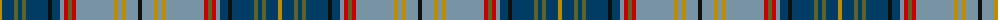

The parent of this is [Harmon of Plenderleith Personal Tartan Tartan Number: 10021. Earliest known date: Mar. 2009 A personal tartan for the Baron of Plenderleith, his family and members of his household. Developed with the help of the House of Tartan, Comrie, Perthshire. See products available Copyright © Blair Urquhart, Comrie, 2015](/tartans/dy/4/db12/g4/db4/g4/db22/k4/db8/b4/r4/g4/r4/b38/dy4/b4/dy4/b12/k/4/)

This was sourced from house-of-tartan.  It is a [18 stripes tartan](/stripes/stripes18/).

Original link http://www.house-of-tartan.scotland.net/house/TartanViewjs.asp?colr=Def&tnam=10021

## Thread count
DY/4 DB12 G4 DB4 G4 DB22 K4 DB8 B4 R4 G4 R4 B38 DY4 B4 DY4 B12 K/4

## Palette
Each colour and its ΔE from the base-6 reference it is a variant of.

| Colour | Shade | Base | ΔE (OKLab) |
|---|---|---|---|
| B |  `#7894A4` | Y  | 0.26 |
| DB |  `#003C64` | B  | 0.07 |
| DY |  `#BC8C00` | Y  | 0.16 |
| G |  `#5C6428` | G  | 0.09 |
| K |  `#101010` | K  | 0.17 |
| R |  `#C80000` | R  | 0.00 |

ID: /variants/dy/4/db12/g4/db4/g4/db22/k4/db8/b4/r4/g4/r4/b38/dy4/b4/dy4/b12/k/4-b7894a4-db003c64-dybc8c00-g5c6428-k101010-rc80000/
