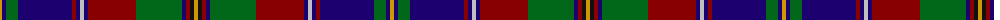

The parent of this is [Olympicana](/tartans/dy/4/db4/g12/db54/dr4/db4/n4/db4/dr48/g46/db4/dr4/k4/dy/4/)

This was sourced from register-of-tartans.  It is a [14 stripes tartan](/stripes/stripes14/).

Original link https://www.tartanregister.gov.uk/tartanDetails.aspx?ref=3243

## Thread count
DY/4 DB4 G12 DB54 DR4 DB4 N4 DB4 DR48 G46 DB4 DR4 K4 DY/4

## Palette
Each colour and its ΔE from the base-6 reference it is a variant of.

| Colour | Shade | Base | ΔE (OKLab) |
|---|---|---|---|
| DB |  `#1C0070` | B  | 0.14 |
| DR |  `#880000` | R  | 0.14 |
| DY |  `#D09800` | Y  | 0.11 |
| G |  `#006818` | G  | 0.02 |
| K |  `#101010` | K  | 0.17 |
| N |  `#C0C0C0` | W  | 0.16 |
| R |  `#C80000` | R  | 0.00 |
| W |  `#FCFCFC` | W  | 0.03 |

ID: /variants/dy/4/db4/g12/db54/dr4/db4/n4/db4/dr48/g46/db4/dr4/k4/dy/4-db1c0070-dr880000-dyd09800-g006818-k101010-nc0c0c0-rc80000-wfcfcfc/
