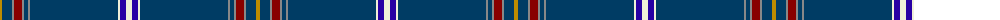

The parent of this is [Jewish (Kosher) (Corporate)](/tartans/dy/4/dba10/n2/dr8/n2/dba4/n2/dba88/ly2/db6/ly/6/)

This was sourced from tartans-authority.  It is a [11 stripes tartan](/stripes/stripes11/).

Original link http://www.tartansauthority.com/tartan-ferret/display/7615/

## Thread count
DY/4 DBa10 N2 DR8 N2 DBa4 N2 DBa88 LY2 DB6 LY/6

## Palette
Each colour and its ΔE from the base-6 reference it is a variant of.

| Colour | Shade | Base | ΔE (OKLab) |
|---|---|---|---|
| DB |  `#2800A4` | B  | 0.11 |
| DBa |  `#003C64` | B  | 0.07 |
| DR |  `#880000` | R  | 0.14 |
| DY |  `#BC8C00` | Y  | 0.16 |
| LY |  `#F0F0D8` | W  | 0.03 |
| N |  `#888888` | R  | 0.24 |

ID: /variants/dy/4/dba10/n2/dr8/n2/dba4/n2/dba88/ly2/db6/ly/6-db2800a4-dba003c64-dr880000-dybc8c00-lyf0f0d8-n888888/
