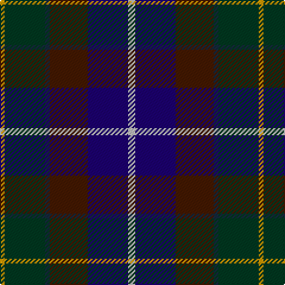

The parent of this is [Ancient Atlantic (Fashion)](/tartans/dy/4/dg34/dn4/dr32/db34/n/6/)

This was sourced from tartans-authority.  It is a [6 stripes tartan](/stripes/stripes6/).

Original link http://www.tartansauthority.com/tartan-ferret/display/1781/

## Thread count
DY/4 DG34 DN4 DR32 DB34 N/6

## Palette
Each colour and its ΔE from the base-6 reference it is a variant of.

| Colour | Shade | Base | ΔE (OKLab) |
|---|---|---|---|
| DB |  `#1C0070` | B  | 0.14 |
| DG |  `#003820` | G  | 0.16 |
| DN |  `#14283C` | B  | 0.14 |
| DR |  `#441800` | B  | 0.22 |
| DY |  `#D09800` | Y  | 0.11 |
| N |  `#C0C0C0` | W  | 0.16 |

# Sample pattern

ID: /variants/dy/4/dg34/dn4/dr32/db34/n/6-db1c0070-dg003820-dn14283c-dr441800-dyd09800-nc0c0c0/
