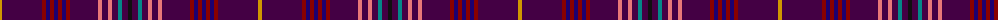

The parent of this is [Wcwm 9275-1422-1](/tartans/dy/4/dp40/dr4/db4/dr4/db4/dr4/db4/dr4/dp28/lr4/dp6/lr4/dp6/b4/dp6/k/4/)

This was sourced from register-of-tartans.  It is a [17 stripes tartan](/stripes/stripes17/).

Original link https://www.tartanregister.gov.uk/tartanDetails.aspx?ref=4565

## Thread count
DY/4 DP40 DR4 DB4 DR4 DB4 DR4 DB4 DR4 DP28 LR4 DP6 LR4 DP6 B4 DP6 K/4

## Palette
Each colour and its ΔE from the base-6 reference it is a variant of.

| Colour | Shade | Base | ΔE (OKLab) |
|---|---|---|---|
| B |  `#048888` | G  | 0.18 |
| DB |  `#1C0070` | B  | 0.14 |
| DP |  `#440044` | B  | 0.17 |
| DR |  `#880000` | R  | 0.14 |
| DY |  `#D09800` | Y  | 0.11 |
| K |  `#101010` | K  | 0.17 |
| LR |  `#E87878` | R  | 0.19 |

ID: /variants/dy/4/dp40/dr4/db4/dr4/db4/dr4/db4/dr4/dp28/lr4/dp6/lr4/dp6/b4/dp6/k/4-b048888-db1c0070-dp440044-dr880000-dyd09800-k101010-lre87878/
