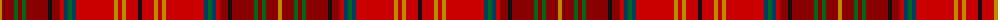

The parent of this is [Harmon (Name)](/tartans/dy/4/dr12/g4/dr4/g4/dr22/k4/dr8/r4/db4/g4/db4/r38/dy4/r4/dy4/r12/k/4/)

This was sourced from tartans-authority.  It is a [18 stripes tartan](/stripes/stripes18/).

Original link http://www.tartansauthority.com/tartan-ferret/display/7792/

## Thread count
DY/4 DR12 G4 DR4 G4 DR22 K4 DR8 R4 DB4 G4 DB4 R38 DY4 R4 DY4 R12 K/4

## Palette
Each colour and its ΔE from the base-6 reference it is a variant of.

| Colour | Shade | Base | ΔE (OKLab) |
|---|---|---|---|
| DB |  `#003C64` | B  | 0.07 |
| DR |  `#880000` | R  | 0.14 |
| DY |  `#BC8C00` | Y  | 0.16 |
| G |  `#006818` | G  | 0.02 |
| K |  `#101010` | K  | 0.17 |
| R |  `#C80000` | R  | 0.00 |

ID: /variants/dy/4/dr12/g4/dr4/g4/dr22/k4/dr8/r4/db4/g4/db4/r38/dy4/r4/dy4/r12/k/4-db003c64-dr880000-dybc8c00-g006818-k101010-rc80000/
