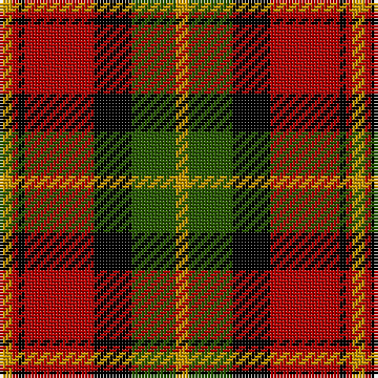

The parent of this is [Blackstock, Red Dress (Clan)](/tartans/dy/4/dr2/k2/dr22/k12/g14/dy/4/)

This was sourced from tartans-authority.  It is a [7 stripes tartan](/stripes/stripes7/).

Original link http://www.tartansauthority.com/tartan-ferret/display/1881/

## Thread count
DY/4 DR2 K2 DR22 K12 G14 DY/4

## Palette
Each colour and its ΔE from the base-6 reference it is a variant of.

| Colour | Shade | Base | ΔE (OKLab) |
|---|---|---|---|
| DR |  `#B00000` | R  | 0.05 |
| DY |  `#C89800` | Y  | 0.12 |
| G |  `#285800` | G  | 0.04 |
| K |  `#000000` | K  | 0.00 |

# Sample pattern

ID: /variants/dy/4/dr2/k2/dr22/k12/g14/dy/4-drb00000-dyc89800-g285800-k000000/
