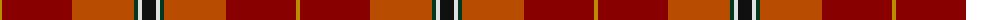

The parent of this is [Mason (Personal)](/tartans/dy/4/dr70/do62/dg4/ln4/k/14/)

This was sourced from tartans-authority.  It is a [6 stripes tartan](/stripes/stripes6/).

Original link http://www.tartansauthority.com/tartan-ferret/display/10720/

## Thread count
DY/4 DR70 DO62 DG4 LN4 K/14

## Palette
Each colour and its ΔE from the base-6 reference it is a variant of.

| Colour | Shade | Base | ΔE (OKLab) |
|---|---|---|---|
| DG |  `#003820` | G  | 0.16 |
| DO |  `#B84C00` | R  | 0.08 |
| DR |  `#880000` | R  | 0.14 |
| DY |  `#BC8C00` | Y  | 0.16 |
| K |  `#101010` | K  | 0.17 |
| LN |  `#E0E0E0` | W  | 0.06 |

# Sample pattern

ID: /variants/dy/4/dr70/do62/dg4/ln4/k/14-dg003820-dob84c00-dr880000-dybc8c00-k101010-lne0e0e0/
