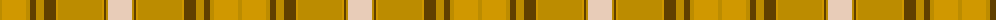

The parent of this is [Wcwm 969-2](/tartans/dy/4/dya24/dy4/t6/dy8/t12/dya2/dy44/dya2/t2/dy2/lr/24/)

This was sourced from register-of-tartans.  It is a [12 stripes tartan](/stripes/stripes12/).

Original link https://www.tartanregister.gov.uk/tartanDetails.aspx?ref=4577

## Thread count
DY/4 DYa24 DY4 T6 DY8 T12 DYa2 DY44 DYa2 T2 DY2 LR/24

## Palette
Each colour and its ΔE from the base-6 reference it is a variant of.

| Colour | Shade | Base | ΔE (OKLab) |
|---|---|---|---|
| DY |  `#BC8C00` | Y  | 0.16 |
| DYa |  `#D09800` | Y  | 0.11 |
| LR |  `#E8CCB8` | W  | 0.11 |
| T |  `#604000` | G  | 0.14 |

ID: /variants/dy/4/dya24/dy4/t6/dy8/t12/dya2/dy44/dya2/t2/dy2/lr/24-dybc8c00-dyad09800-lre8ccb8-t604000/
