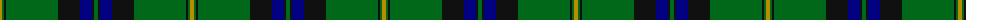

The parent of this is [Mackie (2016)](/tartans/dy/4/g2/k2/g52/k22/db12/k2/g/4/)

This was sourced from register-of-tartans.  It is a [8 stripes tartan](/stripes/stripes8/).

Original link https://www.tartanregister.gov.uk/tartanDetails.aspx?ref=11645

## Thread count
DY/4 G2 K2 G52 K22 DB12 K2 G/4

## Palette
Each colour and its ΔE from the base-6 reference it is a variant of.

| Colour | Shade | Base | ΔE (OKLab) |
|---|---|---|---|
| DB |  `#000080` | B  | 0.14 |
| DY |  `#BC8C00` | Y  | 0.16 |
| G |  `#006818` | G  | 0.02 |
| K |  `#101010` | K  | 0.17 |

# Sample pattern

ID: /variants/dy/4/g2/k2/g52/k22/db12/k2/g/4-db000080-dybc8c00-g006818-k101010/
