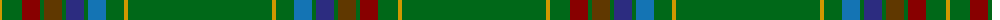

The parent of this is [U.S. Seabees](/tartans/dy/4/g20/dr18/g4/t18/g4/dba18/g4/ba18/g18/dy4/g144/dy4/g18/ba18/g4/dba18/g4/t18/g4/dr18/g20/dy4/g/144/)

This was sourced from register-of-tartans.  It is a [24 stripes tartan](/stripes/stripes24/).

Original link https://www.tartanregister.gov.uk/tartanDetails.aspx?ref=4877

## Thread count
DY/4 G20 DR18 G4 T18 G4 DBa18 G4 Ba18 G18 DY4 G144 DY4 G18 Ba18 G4 DBa18 G4 T18 G4 DR18 G20 DY4 G/144

## Palette
Each colour and its ΔE from the base-6 reference it is a variant of.

| Colour | Shade | Base | ΔE (OKLab) |
|---|---|---|---|
| B |  `#48A4C0` | Y  | 0.28 |
| Ba |  `#1474B4` | B  | 0.15 |
| DB |  `#1C0070` | B  | 0.14 |
| DBa |  `#2C2C80` | B  | 0.05 |
| DR |  `#880000` | R  | 0.14 |
| DY |  `#D09800` | Y  | 0.11 |
| G |  `#006818` | G  | 0.02 |
| T |  `#603800` | G  | 0.16 |

ID: /variants/dy/4/g20/dr18/g4/t18/g4/dba18/g4/ba18/g18/dy4/g144/dy4/g18/ba18/g4/dba18/g4/t18/g4/dr18/g20/dy4/g/144-b48a4c0-ba1474b4-db1c0070-dba2c2c80-dr880000-dyd09800-g006818-t603800/
