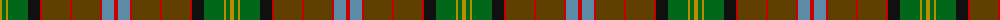

The parent of this is [Ogg of Tarragann Hunting (Personal)](/tartans/dy/4/g4/dy2/g20/k12/r2/t28/r2/t28/r2/b12/r/4/)

This was sourced from tartans-authority.  It is a [12 stripes tartan](/stripes/stripes12/).

Original link http://www.tartansauthority.com/tartan-ferret/display/10179/

## Thread count
DY/4 G4 DY2 G20 K12 R2 T28 R2 T28 R2 B12 R/4

## Palette
Each colour and its ΔE from the base-6 reference it is a variant of.

| Colour | Shade | Base | ΔE (OKLab) |
|---|---|---|---|
| B |  `#5C8CA8` | B  | 0.23 |
| DY |  `#BC8C00` | Y  | 0.16 |
| G |  `#006818` | G  | 0.02 |
| K |  `#101010` | K  | 0.17 |
| R |  `#C80000` | R  | 0.00 |
| T |  `#604000` | G  | 0.14 |

ID: /variants/dy/4/g4/dy2/g20/k12/r2/t28/r2/t28/r2/b12/r/4-b5c8ca8-dybc8c00-g006818-k101010-rc80000-t604000/
