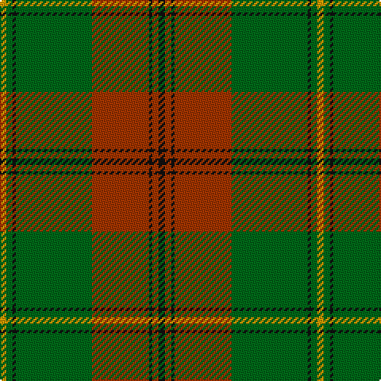

The parent of this is [Gleneil Corporate Tartan Tartan Number: 2545. Earliest known date: 1996 The STS calls this a spoof tartan. Designed by J B Renwick of Lochcarron for Gleneil Publishers to accompany their fictional book by Michael Brander on the bogus Gleneil clan. The tartan is Johnston with blue changed to red. See products available Copyright © Blair Urquhart, Comrie, 2015](/tartans/dy/4/g4/k2/g48/r36/k2/r4/k/4/)

This was sourced from house-of-tartan.  It is a [8 stripes tartan](/stripes/stripes8/).

Original link http://www.house-of-tartan.scotland.net/house/TartanViewjs.asp?colr=Def&tnam=2545

## Thread count
DY/4 G4 K2 G48 R36 K2 R4 K/4

## Palette
Each colour and its ΔE from the base-6 reference it is a variant of.

| Colour | Shade | Base | ΔE (OKLab) |
|---|---|---|---|
| DY |  `#D09800` | Y  | 0.11 |
| G |  `#006818` | G  | 0.02 |
| K |  `#101010` | K  | 0.17 |
| R |  `#A03400` | R  | 0.08 |

# Sample pattern

ID: /variants/dy/4/g4/k2/g48/r36/k2/r4/k/4-dyd09800-g006818-k101010-ra03400/
