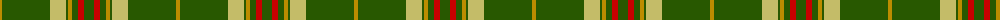
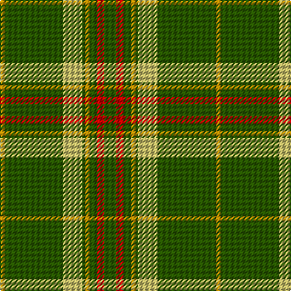

The parent of this is [St. Christopher (Corporate)](/tartans/dy/4/g48/lg16/g2/dy4/g6/r6/g/10/)

This was sourced from tartans-authority.  It is a [8 stripes tartan](/stripes/stripes8/).

Original link http://www.tartansauthority.com/tartan-ferret/display/6778/

## Thread count
DY/4 G48 LG16 G2 DY4 G6 R6 G/10

## Palette
Each colour and its ΔE from the base-6 reference it is a variant of.

| Colour | Shade | Base | ΔE (OKLab) |
|---|---|---|---|
| DY |  `#BC8C00` | Y  | 0.16 |
| G |  `#285800` | G  | 0.04 |
| LG |  `#C4BC68` | Y  | 0.07 |
| R |  `#C80000` | R  | 0.00 |

# Sample pattern

ID: /variants/dy/4/g48/lg16/g2/dy4/g6/r6/g/10-dybc8c00-g285800-lgc4bc68-rc80000/
