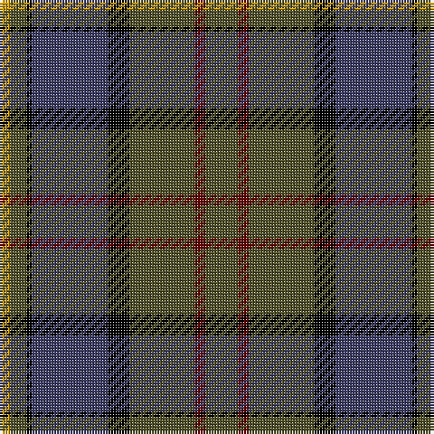

The parent of this is [Mica, Green (Fashion)](/tartans/dy/4/g6/k2/n28/k8/g24/dr4/g/12/)

This was sourced from tartans-authority.  It is a [8 stripes tartan](/stripes/stripes8/).

Original link http://www.tartansauthority.com/tartan-ferret/display/3472/

## Thread count
DY/4 G6 K2 N28 K8 G24 DR4 G/12

## Palette
Each colour and its ΔE from the base-6 reference it is a variant of.

| Colour | Shade | Base | ΔE (OKLab) |
|---|---|---|---|
| DR |  `#640000` | R  | 0.22 |
| DY |  `#C89800` | Y  | 0.12 |
| G |  `#505028` | G  | 0.11 |
| K |  `#000000` | K  | 0.00 |
| N |  `#3C3C64` | B  | 0.06 |

# Sample pattern

ID: /variants/dy/4/g6/k2/n28/k8/g24/dr4/g/12-dr640000-dyc89800-g505028-k000000-n3c3c64/
