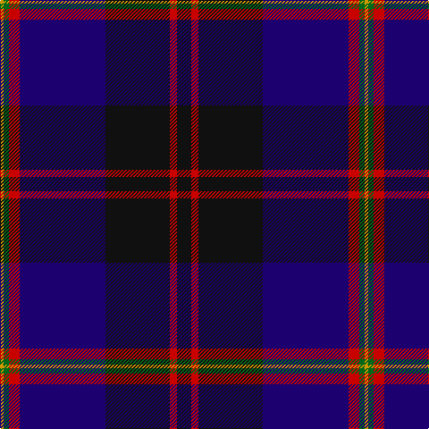

The parent of this is [Royal Marines Condor (Military)](/tartans/dy/4/g6/r12/db96/k72/r8/k/16/)

This was sourced from tartans-authority.  It is a [7 stripes tartan](/stripes/stripes7/).

Original link http://www.tartansauthority.com/tartan-ferret/display/2330/

## Thread count
DY/4 G6 R12 DB96 K72 R8 K/16

## Palette
Each colour and its ΔE from the base-6 reference it is a variant of.

| Colour | Shade | Base | ΔE (OKLab) |
|---|---|---|---|
| DB |  `#1C0070` | B  | 0.14 |
| DY |  `#D09800` | Y  | 0.11 |
| G |  `#006818` | G  | 0.02 |
| K |  `#101010` | K  | 0.17 |
| R |  `#C80000` | R  | 0.00 |

# Sample pattern

ID: /variants/dy/4/g6/r12/db96/k72/r8/k/16-db1c0070-dyd09800-g006818-k101010-rc80000/
