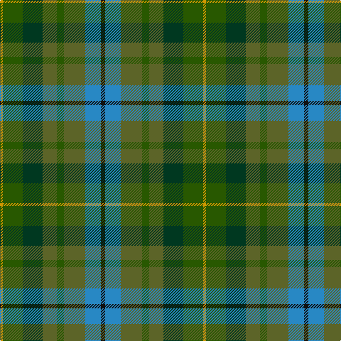

The parent of this is [Brocliande (Fashion))](/tartans/dy/4/ga28/dg28/g20/ga10/g30/b22/k/6/)

This was sourced from tartans-authority.  It is a [8 stripes tartan](/stripes/stripes8/).

Original link http://www.tartansauthority.com/tartan-ferret/display/10812/

## Thread count
DY/4 Ga28 DG28 G20 Ga10 G30 B22 K/6

## Palette
Each colour and its ΔE from the base-6 reference it is a variant of.

| Colour | Shade | Base | ΔE (OKLab) |
|---|---|---|---|
| B |  `#2888C4` | B  | 0.21 |
| DG |  `#003820` | G  | 0.16 |
| DY |  `#D09800` | Y  | 0.11 |
| G |  `#5C6428` | G  | 0.09 |
| Ga |  `#285800` | G  | 0.04 |
| K |  `#101010` | K  | 0.17 |

# Sample pattern

ID: /variants/dy/4/ga28/dg28/g20/ga10/g30/b22/k/6-b2888c4-dg003820-dyd09800-g5c6428-ga285800-k101010/
