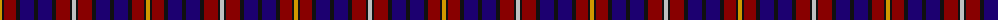

The parent of this is [Mount Isla Weavers Tartan Tartan Number: 5654. Earliest known date: pre 2002 From D C Dalgliesh of Selkirk. See products available Copyright © Blair Urquhart, Comrie, 2015](/tartans/dy/4/k2/dr12/k4/db14/k4/db14/k4/dr14/k2/n/4/)

This was sourced from house-of-tartan.  It is a [11 stripes tartan](/stripes/stripes11/).

Original link http://www.house-of-tartan.scotland.net/house/TartanViewjs.asp?colr=Def&tnam=5654

## Thread count
DY/4 K2 DR12 K4 DB14 K4 DB14 K4 DR14 K2 N/4

## Palette
Each colour and its ΔE from the base-6 reference it is a variant of.

| Colour | Shade | Base | ΔE (OKLab) |
|---|---|---|---|
| DB |  `#1C0070` | B  | 0.14 |
| DR |  `#880000` | R  | 0.14 |
| DY |  `#D09800` | Y  | 0.11 |
| K |  `#101010` | K  | 0.17 |
| N |  `#C0C0C0` | W  | 0.16 |

ID: /variants/dy/4/k2/dr12/k4/db14/k4/db14/k4/dr14/k2/n/4-db1c0070-dr880000-dyd09800-k101010-nc0c0c0/
