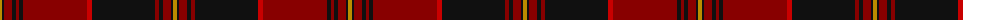

The parent of this is [German Heritage (Fashion) American Fashion Tartan Tartan Number: 7016. Earliest known date: December 2006 Designed by William C. (Rocky) Roeger III of usakilts.com to honor anyone with German heritage. Itr is a private fashion tartan designed for ANYONE to wear, regardless of clan affiliation or nationality. The Colours were chosen to reflect those of the German flag. Woven sample. See products available Copyright © Blair Urquhart, Comrie, 2015](/tartans/dy/4/k2/dr8/k4/dr3/k4/dr64/r5/k63/dr4/k4/dr8/k2/dy/4/)

This was sourced from house-of-tartan.  It is a [14 stripes tartan](/stripes/stripes14/).

Original link http://www.house-of-tartan.scotland.net/house/TartanViewjs.asp?colr=Def&tnam=7016

## Thread count
DY/4 K2 DR8 K4 DR3 K4 DR64 R5 K63 DR4 K4 DR8 K2 DY/4

## Palette
Each colour and its ΔE from the base-6 reference it is a variant of.

| Colour | Shade | Base | ΔE (OKLab) |
|---|---|---|---|
| DR |  `#880000` | R  | 0.14 |
| DY |  `#BC8C00` | Y  | 0.16 |
| K |  `#101010` | K  | 0.17 |
| R |  `#C80000` | R  | 0.00 |

ID: /variants/dy/4/k2/dr8/k4/dr3/k4/dr64/r5/k63/dr4/k4/dr8/k2/dy/4-dr880000-dybc8c00-k101010-rc80000/
