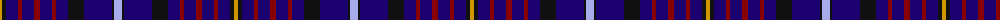

The parent of this is [Aberdale (Fashion)](/tartans/dy/4/k4/db12/dr4/db12/dr6/db12/dr4/db12/k16/db28/k2/lp/8/)

This was sourced from tartans-authority.  It is a [13 stripes tartan](/stripes/stripes13/).

Original link http://www.tartansauthority.com/tartan-ferret/display/3005/

## Thread count
DY/4 K4 DB12 DR4 DB12 DR6 DB12 DR4 DB12 K16 DB28 K2 LP/8

## Palette
Each colour and its ΔE from the base-6 reference it is a variant of.

| Colour | Shade | Base | ΔE (OKLab) |
|---|---|---|---|
| DB |  `#1C0070` | B  | 0.14 |
| DR |  `#880000` | R  | 0.14 |
| DY |  `#D09800` | Y  | 0.11 |
| K |  `#101010` | K  | 0.17 |
| LP |  `#A8ACE8` | W  | 0.22 |

ID: /variants/dy/4/k4/db12/dr4/db12/dr6/db12/dr4/db12/k16/db28/k2/lp/8-db1c0070-dr880000-dyd09800-k101010-lpa8ace8/
