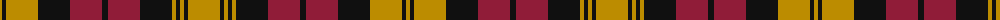

The parent of this is [Unidentified (NZ)](/tartans/dy/4/k4/dy32/k32/dr32/k6/dr32/k32/dy4/k4/dy4/k4/dy/32/)

This was sourced from tartans-authority.  It is a [13 stripes tartan](/stripes/stripes13/).

Original link http://www.tartansauthority.com/tartan-ferret/display/8459/

## Thread count
DY/4 K4 DY32 K32 DR32 K6 DR32 K32 DY4 K4 DY4 K4 DY/32

## Palette
Each colour and its ΔE from the base-6 reference it is a variant of.

| Colour | Shade | Base | ΔE (OKLab) |
|---|---|---|---|
| DR |  `#901C38` | R  | 0.12 |
| DY |  `#BC8C00` | Y  | 0.16 |
| K |  `#101010` | K  | 0.17 |

ID: /variants/dy/4/k4/dy32/k32/dr32/k6/dr32/k32/dy4/k4/dy4/k4/dy/32-dr901c38-dybc8c00-k101010/
