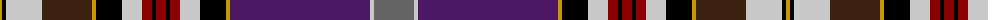

The parent of this is [Unnamed C19th](/tartans/dy/4/k4/na36/ka50/dy4/k26/na20/dr10/k4/dr10/k4/dr10/na20/k26/dy4/dp140/na4/n/40/)

This was sourced from register-of-tartans.  It is a [18 stripes tartan](/stripes/stripes18/).

Original link https://www.tartanregister.gov.uk/tartanDetails.aspx?ref=4424

## Thread count
DY/4 K4 Na36 Ka50 DY4 K26 Na20 DR10 K4 DR10 K4 DR10 Na20 K26 DY4 DP140 Na4 N/40

## Palette
Each colour and its ΔE from the base-6 reference it is a variant of.

| Colour | Shade | Base | ΔE (OKLab) |
|---|---|---|---|
| DP |  `#4C1864` | B  | 0.11 |
| DR |  `#8C0000` | R  | 0.13 |
| DY |  `#C89800` | Y  | 0.12 |
| K |  `#000000` | K  | 0.00 |
| Ka |  `#3C2010` | B  | 0.20 |
| N |  `#646464` | B  | 0.16 |
| Na |  `#C8C8C8` | W  | 0.13 |

ID: /variants/dy/4/k4/na36/ka50/dy4/k26/na20/dr10/k4/dr10/k4/dr10/na20/k26/dy4/dp140/na4/n/40-dp4c1864-dr8c0000-dyc89800-k000000-ka3c2010-n646464-nac8c8c8/
