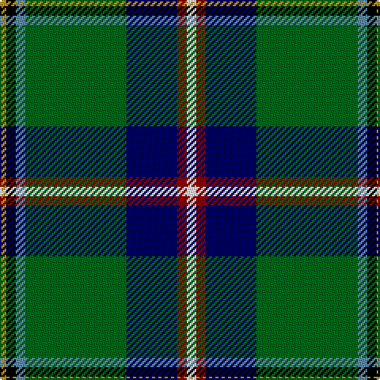

The parent of this is [Washington State](/tartans/dy/4/k6/b6/g64/db32/dr6/w/6/)

This was sourced from register-of-tartans.  It is a [7 stripes tartan](/stripes/stripes7/).

Original link https://www.tartanregister.gov.uk/tartanDetails.aspx?ref=4495

## Thread count
DY/4 K6 B6 G64 DB32 DR6 W/6

## Palette
Each colour and its ΔE from the base-6 reference it is a variant of.

| Colour | Shade | Base | ΔE (OKLab) |
|---|---|---|---|
| B |  `#5C8CA8` | B  | 0.23 |
| DB |  `#000064` | B  | 0.17 |
| DBa |  `#00248C` | B  | 0.09 |
| DG |  `#003014` | G  | 0.18 |
| DR |  `#8C0000` | R  | 0.13 |
| DY |  `#C89800` | Y  | 0.12 |
| G |  `#006818` | G  | 0.02 |
| K |  `#000000` | K  | 0.00 |
| LB |  `#98C8E8` | W  | 0.17 |
| LP |  `#A8ACE8` | W  | 0.22 |
| N |  `#C8C8C8` | W  | 0.13 |
| W |  `#F8F8F8` | W  | 0.01 |

# Sample pattern

ID: /variants/dy/4/k6/b6/g64/db32/dr6/w/6-b5c8ca8-db000064-dba00248c-dg003014-dr8c0000-dyc89800-g006818-k000000-lb98c8e8-lpa8ace8-nc8c8c8-wf8f8f8/
