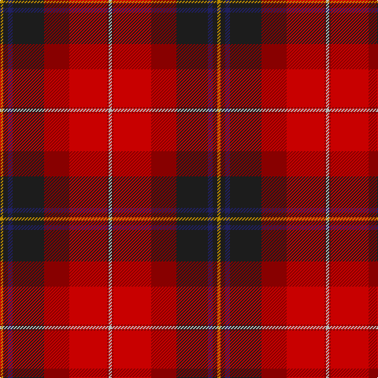

The parent of this is [Tache, Sir Etienne Paschal](/tartans/dy/4/k6/db6/k40/dr32/r48/dr2/n/4/)

This was sourced from register-of-tartans.  It is a [8 stripes tartan](/stripes/stripes8/).

Original link https://www.tartanregister.gov.uk/tartanDetails.aspx?ref=4061

## Thread count
DY/4 K6 DB6 K40 DR32 R48 DR2 N/4

## Palette
Each colour and its ΔE from the base-6 reference it is a variant of.

| Colour | Shade | Base | ΔE (OKLab) |
|---|---|---|---|
| DB |  `#202060` | B  | 0.11 |
| DR |  `#880000` | R  | 0.14 |
| DY |  `#BC8C00` | Y  | 0.16 |
| K |  `#1C1C1C` | B  | 0.20 |
| N |  `#B8B8B8` | Y  | 0.17 |
| R |  `#C80000` | R  | 0.00 |

# Sample pattern

ID: /variants/dy/4/k6/db6/k40/dr32/r48/dr2/n/4-db202060-dr880000-dybc8c00-k1c1c1c-nb8b8b8-rc80000/
