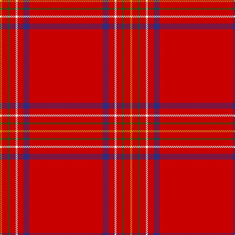

The parent of this is [Burnett of Leys (Clan)](/tartans/dy/4/r12/g4/r12/w4/r12/db12/r/150/)

This was sourced from tartans-authority.  It is a [8 stripes tartan](/stripes/stripes8/).

Original link http://www.tartansauthority.com/tartan-ferret/display/1430/

## Thread count
DY/4 R12 G4 R12 W4 R12 DB12 R/150

## Palette
Each colour and its ΔE from the base-6 reference it is a variant of.

| Colour | Shade | Base | ΔE (OKLab) |
|---|---|---|---|
| DB |  `#2C2C80` | B  | 0.05 |
| DY |  `#D09800` | Y  | 0.11 |
| G |  `#006818` | G  | 0.02 |
| R |  `#C80000` | R  | 0.00 |
| W |  `#F8F8F8` | W  | 0.01 |

# Sample pattern

ID: /variants/dy/4/r12/g4/r12/w4/r12/db12/r/150-db2c2c80-dyd09800-g006818-rc80000-wf8f8f8/
