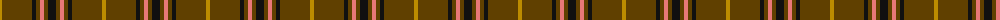
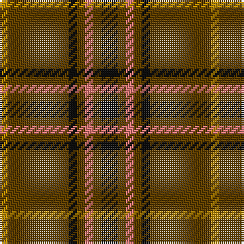

The parent of this is [Welsh National (Fashion)](/tartans/dy/4/t30/k4/t4/lr4/t4/k/8/)

This was sourced from tartans-authority.  It is a [7 stripes tartan](/stripes/stripes7/).

Original link http://www.tartansauthority.com/tartan-ferret/display/2167/

## Thread count
DY/4 T30 K4 T4 LR4 T4 K/8

## Palette
Each colour and its ΔE from the base-6 reference it is a variant of.

| Colour | Shade | Base | ΔE (OKLab) |
|---|---|---|---|
| DY |  `#BC8C00` | Y  | 0.16 |
| K |  `#101010` | K  | 0.17 |
| LR |  `#E87878` | R  | 0.19 |
| T |  `#604000` | G  | 0.14 |

# Sample pattern

ID: /variants/dy/4/t30/k4/t4/lr4/t4/k/8-dybc8c00-k101010-lre87878-t604000/
