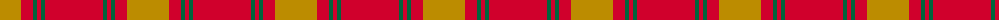
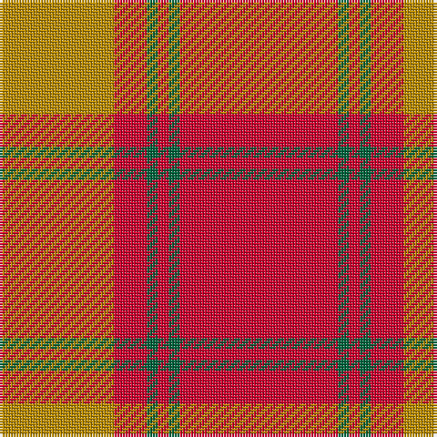

The parent of this is [Maguire, Black (Name)](/tartans/dy/42/r12/g4/r4/g4/r/58/)

This was sourced from tartans-authority.  It is a [6 stripes tartan](/stripes/stripes6/).

Original link http://www.tartansauthority.com/tartan-ferret/display/6812/

## Thread count
DY/42 R12 G4 R4 G4 R/58

## Palette
Each colour and its ΔE from the base-6 reference it is a variant of.

| Colour | Shade | Base | ΔE (OKLab) |
|---|---|---|---|
| DY |  `#BC8C00` | Y  | 0.16 |
| G |  `#00643C` | G  | 0.06 |
| R |  `#D0002C` | R  | 0.03 |

# Sample pattern

ID: /variants/dy/42/r12/g4/r4/g4/r/58-dybc8c00-g00643c-rd0002c/
