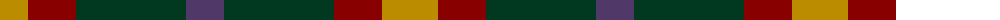

The parent of this is [Hirstwood (Name)](/tartans/dy/56/dr48/dg110/n/38/)

This was sourced from tartans-authority.  It is a [4 stripes tartan](/stripes/stripes4/).

Original link http://www.tartansauthority.com/tartan-ferret/display/8099/

## Thread count
DY/56 DR48 DG110 N/38

## Palette
Each colour and its ΔE from the base-6 reference it is a variant of.

| Colour | Shade | Base | ΔE (OKLab) |
|---|---|---|---|
| DG |  `#003820` | G  | 0.16 |
| DR |  `#880000` | R  | 0.14 |
| DY |  `#BC8C00` | Y  | 0.16 |
| N |  `#503868` | B  | 0.07 |

# Sample pattern

ID: /variants/dy/56/dr48/dg110/n/38-dg003820-dr880000-dybc8c00-n503868/
