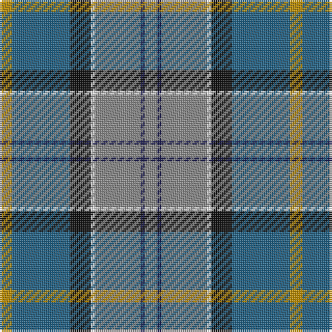

The parent of this is [Glen Lyon (Fashion)](/tartans/dy/6/b28/k10/w2/n22/db2/n/6/)

This was sourced from tartans-authority.  It is a [7 stripes tartan](/stripes/stripes7/).

Original link http://www.tartansauthority.com/tartan-ferret/display/5013/

## Thread count
DY/6 B28 K10 W2 N22 DB2 N/6

## Palette
Each colour and its ΔE from the base-6 reference it is a variant of.

| Colour | Shade | Base | ΔE (OKLab) |
|---|---|---|---|
| B |  `#206084` | B  | 0.09 |
| DB |  `#1C1C50` | B  | 0.14 |
| DY |  `#BC8C00` | Y  | 0.16 |
| K |  `#101010` | K  | 0.17 |
| N |  `#888888` | R  | 0.24 |
| W |  `#FCFCFC` | W  | 0.03 |

# Sample pattern

ID: /variants/dy/6/b28/k10/w2/n22/db2/n/6-b206084-db1c1c50-dybc8c00-k101010-n888888-wfcfcfc/
