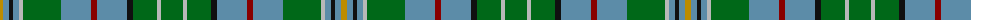

The parent of this is [Greylock (Corporate)](/tartans/dy/6/b6/k4/b6/n4/g38/b30/dr6/b30/k6/g24/n4/g/22/)

This was sourced from tartans-authority.  It is a [13 stripes tartan](/stripes/stripes13/).

Original link http://www.tartansauthority.com/tartan-ferret/display/944/

## Thread count
DY/6 B6 K4 B6 N4 G38 B30 DR6 B30 K6 G24 N4 G/22

## Palette
Each colour and its ΔE from the base-6 reference it is a variant of.

| Colour | Shade | Base | ΔE (OKLab) |
|---|---|---|---|
| B |  `#5C8CA8` | B  | 0.23 |
| DR |  `#880000` | R  | 0.14 |
| DY |  `#BC8C00` | Y  | 0.16 |
| G |  `#006818` | G  | 0.02 |
| K |  `#101010` | K  | 0.17 |
| N |  `#B8B8B8` | Y  | 0.17 |

ID: /variants/dy/6/b6/k4/b6/n4/g38/b30/dr6/b30/k6/g24/n4/g/22-b5c8ca8-dr880000-dybc8c00-g006818-k101010-nb8b8b8/
