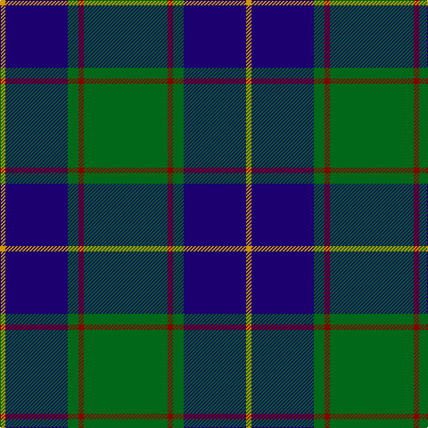

The parent of this is [Gracie (Name)](/tartans/dy/6/db70/g12/dr6/g/94/)

This was sourced from tartans-authority.  It is a [5 stripes tartan](/stripes/stripes5/).

Original link http://www.tartansauthority.com/tartan-ferret/display/2337/

## Thread count
DY/6 DB70 G12 DR6 G/94

## Palette
Each colour and its ΔE from the base-6 reference it is a variant of.

| Colour | Shade | Base | ΔE (OKLab) |
|---|---|---|---|
| DB |  `#1C0070` | B  | 0.14 |
| DR |  `#880000` | R  | 0.14 |
| DY |  `#D09800` | Y  | 0.11 |
| G |  `#006818` | G  | 0.02 |

# Sample pattern

ID: /variants/dy/6/db70/g12/dr6/g/94-db1c0070-dr880000-dyd09800-g006818/
