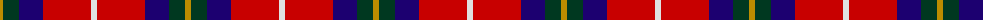

The parent of this is [McGill University (Corporate)](/tartans/dy/6/dg16/db24/r48/ln/6/)

This was sourced from tartans-authority.  It is a [5 stripes tartan](/stripes/stripes5/).

Original link http://www.tartansauthority.com/tartan-ferret/display/10755/

## Thread count
DY/6 DG16 DB24 R48 LN/6

## Palette
Each colour and its ΔE from the base-6 reference it is a variant of.

| Colour | Shade | Base | ΔE (OKLab) |
|---|---|---|---|
| DB |  `#1C0070` | B  | 0.14 |
| DG |  `#003820` | G  | 0.16 |
| DY |  `#BC8C00` | Y  | 0.16 |
| LN |  `#E0E0E0` | W  | 0.06 |
| R |  `#C80000` | R  | 0.00 |

# Sample pattern

ID: /variants/dy/6/dg16/db24/r48/ln/6-db1c0070-dg003820-dybc8c00-lne0e0e0-rc80000/
