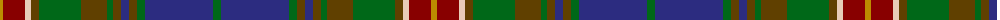

The parent of this is [State Seal of Illinois (Fashion)](/tartans/dy/6/dr22/lr6/t8/g42/t26/g6/t8/db8/t8/g8/db68/g/8/)

This was sourced from tartans-authority.  It is a [13 stripes tartan](/stripes/stripes13/).

Original link http://www.tartansauthority.com/tartan-ferret/display/8627/

## Thread count
DY/6 DR22 LR6 T8 G42 T26 G6 T8 DB8 T8 G8 DB68 G/8

## Palette
Each colour and its ΔE from the base-6 reference it is a variant of.

| Colour | Shade | Base | ΔE (OKLab) |
|---|---|---|---|
| DB |  `#2C2C80` | B  | 0.05 |
| DR |  `#880000` | R  | 0.14 |
| DY |  `#BC8C00` | Y  | 0.16 |
| G |  `#006818` | G  | 0.02 |
| LR |  `#E8CCB8` | W  | 0.11 |
| T |  `#604000` | G  | 0.14 |

ID: /variants/dy/6/dr22/lr6/t8/g42/t26/g6/t8/db8/t8/g8/db68/g/8-db2c2c80-dr880000-dybc8c00-g006818-lre8ccb8-t604000/
