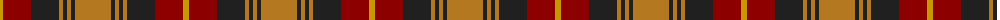
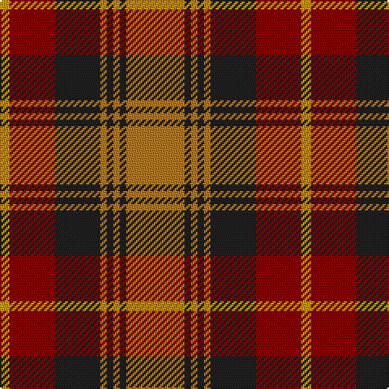

The parent of this is [Talladale (Fashion)](/tartans/dy/6/dr28/k28/lt4/k4/lt4/k4/lt/36/)

This was sourced from tartans-authority.  It is a [8 stripes tartan](/stripes/stripes8/).

Original link http://www.tartansauthority.com/tartan-ferret/display/5143/

## Thread count
DY/6 DR28 K28 LT4 K4 LT4 K4 LT/36

## Palette
Each colour and its ΔE from the base-6 reference it is a variant of.

| Colour | Shade | Base | ΔE (OKLab) |
|---|---|---|---|
| DR |  `#8C0000` | R  | 0.13 |
| DY |  `#C89800` | Y  | 0.12 |
| K |  `#202020` | B  | 0.19 |
| LT |  `#B47820` | R  | 0.18 |

# Sample pattern

ID: /variants/dy/6/dr28/k28/lt4/k4/lt4/k4/lt/36-dr8c0000-dyc89800-k202020-ltb47820/
