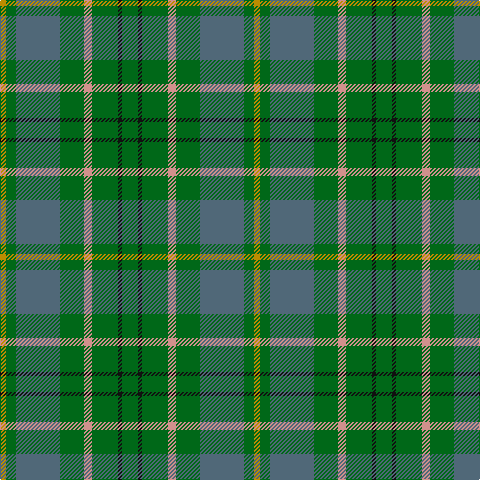

The parent of this is [Taylor (Clan)](/tartans/dy/6/g10/n44/g24/lr8/g26/k4/g/16/)

This was sourced from tartans-authority.  It is a [8 stripes tartan](/stripes/stripes8/).

Original link http://www.tartansauthority.com/tartan-ferret/display/809/

## Thread count
DY/6 G10 N44 G24 LR8 G26 K4 G/16

## Palette
Each colour and its ΔE from the base-6 reference it is a variant of.

| Colour | Shade | Base | ΔE (OKLab) |
|---|---|---|---|
| DY |  `#BC8C00` | Y  | 0.16 |
| G |  `#006818` | G  | 0.02 |
| K |  `#101010` | K  | 0.17 |
| LR |  `#D0908C` | Y  | 0.19 |
| N |  `#506878` | B  | 0.14 |

# Sample pattern

ID: /variants/dy/6/g10/n44/g24/lr8/g26/k4/g/16-dybc8c00-g006818-k101010-lrd0908c-n506878/
