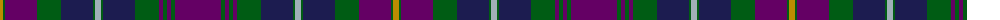

The parent of this is [Pitlochry (District)](/tartans/dy/6/g2/p32/g24/db32/g2/n6/g2/db32/g24/p4/g4/p4/g4/p/46/)

This was sourced from tartans-authority.  It is a [15 stripes tartan](/stripes/stripes15/).

Original link http://www.tartansauthority.com/tartan-ferret/display/10172/

## Thread count
DY/6 G2 P32 G24 DB32 G2 N6 G2 DB32 G24 P4 G4 P4 G4 P/46

## Palette
Each colour and its ΔE from the base-6 reference it is a variant of.

| Colour | Shade | Base | ΔE (OKLab) |
|---|---|---|---|
| DB |  `#1C1C50` | B  | 0.14 |
| DY |  `#BC8C00` | Y  | 0.16 |
| G |  `#005C14` | G  | 0.03 |
| N |  `#A0B0B8` | Y  | 0.20 |
| P |  `#640064` | B  | 0.15 |

ID: /variants/dy/6/g2/p32/g24/db32/g2/n6/g2/db32/g24/p4/g4/p4/g4/p/46-db1c1c50-dybc8c00-g005c14-na0b0b8-p640064/
