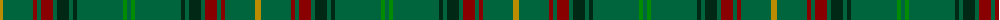

The parent of this is [INSEAD](/tartans/dy/6/g30/dr4/g4/dr12/g4/dg12/g4/dg4/g46/ga4/g/4/)

This was sourced from register-of-tartans.  It is a [12 stripes tartan](/stripes/stripes12/).

Original link https://www.tartanregister.gov.uk/tartanDetails.aspx?ref=11527

## Thread count
DY/6 G30 DR4 G4 DR12 G4 DG12 G4 DG4 G46 Ga4 G/4

## Palette
Each colour and its ΔE from the base-6 reference it is a variant of.

| Colour | Shade | Base | ΔE (OKLab) |
|---|---|---|---|
| DG |  `#002814` | B  | 0.21 |
| DR |  `#880000` | R  | 0.14 |
| DY |  `#BC8C00` | Y  | 0.16 |
| G |  `#00643C` | G  | 0.06 |
| Ga |  `#008B00` | G  | 0.12 |

ID: /variants/dy/6/g30/dr4/g4/dr12/g4/dg12/g4/dg4/g46/ga4/g/4-dg002814-dr880000-dybc8c00-g00643c-ga008b00/
