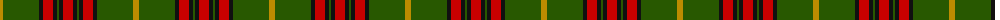

The parent of this is [Midpac Tissue (non woven)](/tartans/dy/6/g36/k4/r10/k4/g2/k4/r/10/)

This was sourced from tartans-authority.  It is a [8 stripes tartan](/stripes/stripes8/).

Original link http://www.tartansauthority.com/tartan-ferret/display/6957/

## Thread count
DY/6 G36 K4 R10 K4 G2 K4 R/10

## Palette
Each colour and its ΔE from the base-6 reference it is a variant of.

| Colour | Shade | Base | ΔE (OKLab) |
|---|---|---|---|
| DY |  `#BC8C00` | Y  | 0.16 |
| G |  `#285800` | G  | 0.04 |
| K |  `#101010` | K  | 0.17 |
| R |  `#C80000` | R  | 0.00 |

# Sample pattern

ID: /variants/dy/6/g36/k4/r10/k4/g2/k4/r/10-dybc8c00-g285800-k101010-rc80000/
