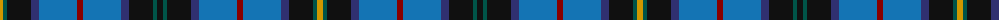

The parent of this is [Loch Lomond Millenium (Fashion)](/tartans/dy/6/g4/k24/db8/b38/dr6/b38/db8/k24/g4/k/6/)

This was sourced from tartans-authority.  It is a [11 stripes tartan](/stripes/stripes11/).

Original link http://www.tartansauthority.com/tartan-ferret/display/2520/

## Thread count
DY/6 G4 K24 DB8 B38 DR6 B38 DB8 K24 G4 K/6

## Palette
Each colour and its ΔE from the base-6 reference it is a variant of.

| Colour | Shade | Base | ΔE (OKLab) |
|---|---|---|---|
| B |  `#1474B4` | B  | 0.15 |
| DB |  `#303070` | B  | 0.05 |
| DR |  `#880000` | R  | 0.14 |
| DY |  `#D09800` | Y  | 0.11 |
| G |  `#005448` | G  | 0.11 |
| K |  `#101010` | K  | 0.17 |

ID: /variants/dy/6/g4/k24/db8/b38/dr6/b38/db8/k24/g4/k/6-b1474b4-db303070-dr880000-dyd09800-g005448-k101010/
