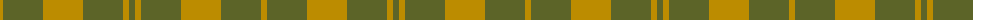
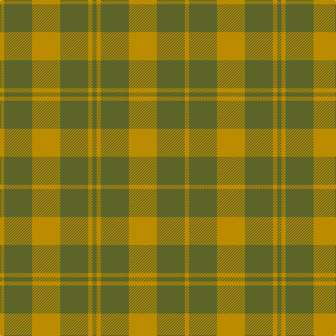

The parent of this is [Barbie's Moss Plaid (Yellow & Green)](/tartans/dy/6/g40/dy40/g40/dy6/g/6/)

This was sourced from register-of-tartans.  It is a [6 stripes tartan](/stripes/stripes6/).

Original link https://www.tartanregister.gov.uk/tartanDetails.aspx?ref=210

## Thread count
DY/6 G40 DY40 G40 DY6 G/6

## Palette
Each colour and its ΔE from the base-6 reference it is a variant of.

| Colour | Shade | Base | ΔE (OKLab) |
|---|---|---|---|
| B |  `#2888C4` | B  | 0.21 |
| DB |  `#003C64` | B  | 0.07 |
| DY |  `#BC8C00` | Y  | 0.16 |
| G |  `#5C6428` | G  | 0.09 |
| N |  `#C0C0C0` | W  | 0.16 |
| W |  `#FCFCFC` | W  | 0.03 |

# Sample pattern

ID: /variants/dy/6/g40/dy40/g40/dy6/g/6-b2888c4-db003c64-dybc8c00-g5c6428-nc0c0c0-wfcfcfc/
